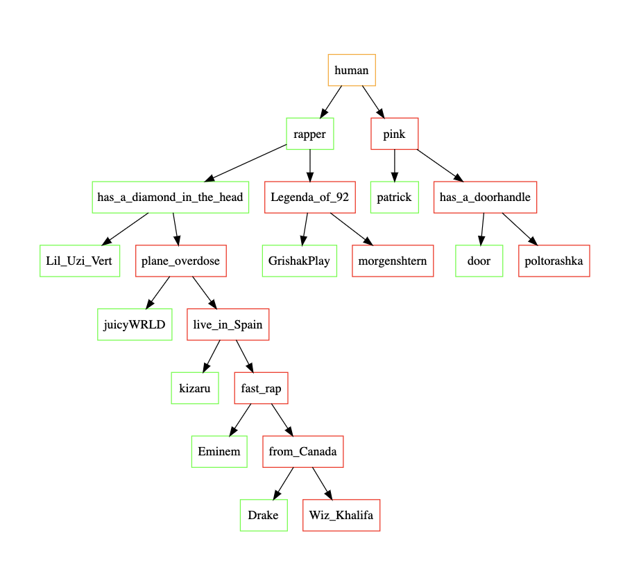

# akinator
The program recalls that game "Akinator". This program creates a database in a text file using { }.
The database looks like this:

{ ...
    {...
    }
}

between { } words are inserted that are tied to the corresponding branches.

My game has 5 modes:
1) guess the person. If there is no such character, then you can add it to the database and in the next game "Aki" can guess your person;
2) you can compare 2 person in the tree;
3) you can know, who is in the tree and "Aki" try to win you.

In the game you can see virtual menu, where you can choose variant and see, how persons contain in the tree.

Graph dump tree: 

